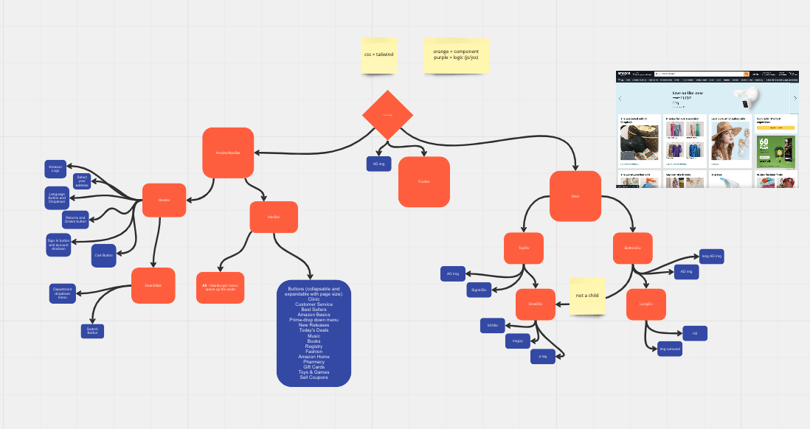

# codename `devs` nextdoor

<hr/>

<h2> The following has been installed in this repo. </h2>

- Tailwind.css
- Redux

Once forked and cloned:

```js
npm install
```

or

```js
npm i
```

|            <h2>Task</h2>             | <h2>Duration</h2> |
| :----------------------------------: | ----------------- |
| To create a functioning amazon clone | 2 - 3 Week Sprint |

Development Team's Focus

1. Functionality
2. Usability
3. Performance
4. Security
5. Scalability
6. Maintainability

Team Structure
| <h2>Dev Team</h2> | <h2>Role</h2> |
| :--------------: | :-------: |
| <b>Harold F.</b> | Team Lead |
| <b>Joshua N.</b> | Dev Lead |
| <b>Keeanu R.</b> | Test Lead |

---

## Tech used in this project

- React.js
- Tailwind.css
- Axios
- Toolkit Redux

_maybe_

- Redux
- Routing
- Cypress Testing

---

## Git Commands

- git remote add upstream https://github.com/whoever/whatever.git (only for the first time)
- git fetch upstream (Grabs Changes From the Original Repo)
- git checkout main (Your main branch)
- git merge upstream/main (Merges the changes from the original repo)
- git checkout (Your testing branch)
- git merge main (Grabs changes from your main)
- git add . (Add changes to your testing branch)
- git commit (Commit changes to testing branch)
- git push (Push changes to you Github repo)
- make a pull request to the original repo

## [Miro Board](https://miro.com/app/board/uXjVPlpwwDI=/?share_link_id=170132353600)



## [Project Goal](https://www.amazon.com/)


# Variable Names and Function Name [Structure]

# Resources

[Tailwind.css](https://tailwindcss.com/)

[Adding / Editing Wiki Pages](https://docs.github.com/en/communities/documenting-your-project-with-wikis/adding-or-editing-wiki-pages)

[How to Make a Carousel](https://www.makeuseof.com/react-js-interactive-carousel-build/)

[Merge or Rebase?](https://www.atlassian.com/git/tutorials/git-forks-and-upstreams)
